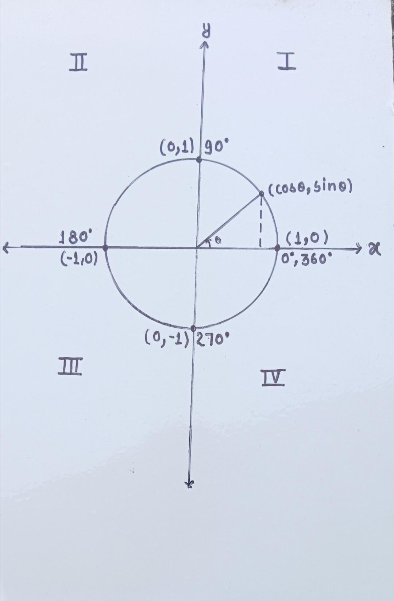

# trigonometry-intuition
Understanding trigonometric ratios at key angles using the unit circle, focusing on intuition rather than memorization 

## Unit Circle Visualization

trigonometry-intuition  
Understanding trigonometric ratios...  

## Unit Circle Visualization

## Why (cosθ, sinθ)?

Any point on the unit circle can be written as (x, y).

From the geometry:
- x = cosθ
- y = sinθ

So the point becomes (cosθ, sinθ).
